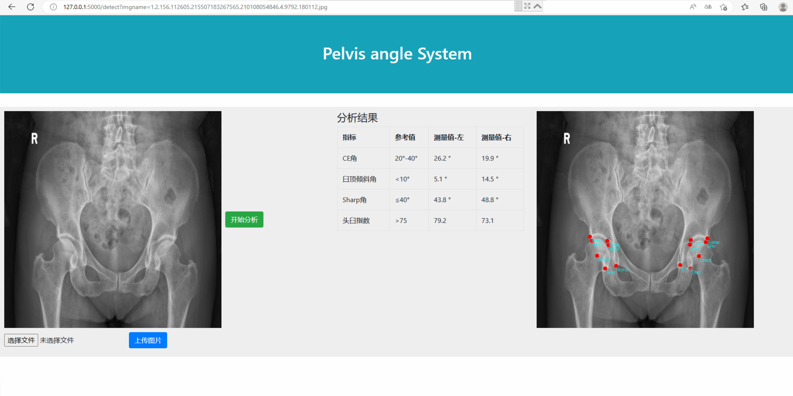
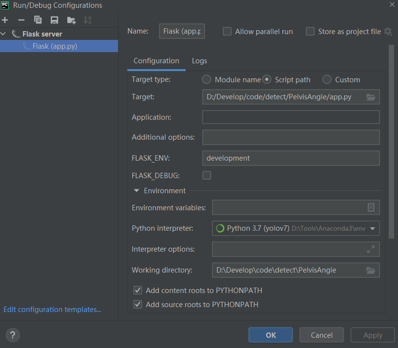

# Automatic Pelvic Evaluation System

This is an automatic pelvic evaluation system, which automatically identifies the landmarks of the pelvis, calculates the angle and compares it with the reference value.

[简体中文文档](https://github.com/huangchenxi304/APES/blob/master/README%20_zh_CN.md)


Tech Stack: Flask + HTML + boostrap + js

Landmark identification model：[YOLO](https://github.com/MIRACLE-Center/YOLO_Universal_Anatomical_Landmark_Detection) and [UNet](https://github.com/milesial/Pytorch-UNet)





## TOC

- [Automatic Pelvic Evaluation System](#automatic-pelvic-evaluation-system)
  - [TOC](#toc)
  - [Installation](#installation)
  - [Project Structure](#project-structure)
  - [Launch](#launch)
  - [Dataset](#dataset)
  - [Training](#training)
    - [1. Training and validation dataset splits (optional)](#1-training-and-validation-dataset-splits-optional)
    - [2. Set the number of keys (optional)](#2-set-the-number-of-keys-optional)
    - [3. Parameter setting (required)](#3-parameter-setting-required)
    - [4. Model selection (optional)](#4-model-selection-optional)
    - [5. Train starting from 0 or loading weight  (required)](#5-train-starting-from-0-or-loading-weight--required)
    - [6. Start training](#6-start-training)
    - [7. Training/Test result](#7-trainingtest-result)
  - [Test](#test)
  - [Validation (generate a result map with predicted points and ground truth)](#validation-generate-a-result-map-with-predicted-points-and-ground-truth)
  - [References](#references)
  - [Acknowledge:bouquet:](#acknowledgebouquet)


## Installation

**Clone the repo and install dependencies.<br>**

```shell
git clone https://github.com/huangchenxi304/APES
pip install - r requirements.txt
```

## Project Structure

```
PelvisAngle
│  app.py
│  README.md
│  requirements.txt
│      
├─static
│  ├─css    
│  ├─images 
│  └─js
│          
├─templates
│      base.html
│      image.html
│      
├─UALD
│  │          
│  ├─data (★★★Put your dataset here!)
│  │  ├─gupen
│  │  │  ├─labels
│  │  │  │      1.3.12.2.1107.5.3.58.40252.12.202101010955490437.json
│  │  │  │      1.3.12.2.1107.5.3.58.40252.12.202101011540210171.json
│  │  │  │      ......
│  │  │  │      
│  │  │  └─pngs
│  │  │          1.3.12.2.1107.5.3.58.40252.12.202101010955490437.jpg
│  │  │          1.3.12.2.1107.5.3.58.40252.12.202101011540210171.jpg
│  │  │          ......
│  │          
│  ├─runs (Store the training, vali and test results of unet and GU2Net models, including weight files)
│  │  └─unet2d_runs
│  │  │        config_origin.yaml
│  │  │        config_train.yaml
│  │  │   
│  │  ├─GU2Net_runs
│  │  │  │  config_origin.yaml
│  │  │  │  config_single.yaml
│  │  │  │  config_test.yaml
│  │  │  │  config_train.yaml
│  │  │  │  learning_rate.png
│  │  │  │  loss.png
│  │  │  │  network_graph.txt
│  │  │  │  
│  │  │  ├─checkpoints (★☆☆GU2Net model weight file generated by training)
│  │  │  │      best_GU2Net_runs_epoch098_train5234.624233_val1716.078491.pt
│  │  │  │      best_GU2Net_runs_epoch098_train73.344884_val17.906089.pt
│  │  │  │      ......
│  │  │  │      train_val_loss.txt
│  │  │  │      
│  │  │  └─results
│  │  │      ├─loss
│  │  │      │      epoch_098_loss_54.583926.txt
│  │  │      │      epoch_099_loss_17.908456.txt
│  │  │      │      ......
│  │  │      │      
│  │  │      ├─single_epoch000 (☆☆☆Store intermediate results, such as the generated heatmap)
│  │  │      │  └─gupen
│  │  │      │          1.2.156.112605.215507183267565.210112031150.4.9460.116412.jpg_gt-pred.png
│  │  │      │          1.2.156.112605.215507183267565.210112031150.4.9460.116412.jpg_gt.npy
│  │  │      │          1.2.156.112605.215507183267565.210112031150.4.9460.116412.jpg_gt.png
│  │  │      │          1.2.156.112605.215507183267565.210112031150.4.9460.116412.jpg_input.npy
│  │  │      │          
│  │  │      └─train_epoch099 (☆☆☆Store intermediate results, such as the generated heatmap)
│  │  │          └─gupen
│  │  │                  1.3.46.670589.26.902153.4.20180821.102032.657106.0.jpg_gt-pred.png
│  │  │                  1.3.46.670589.26.902153.4.20180821.102032.657106.0.jpg_gt.npy
│  │  │                  1.3.46.670589.26.902153.4.20180821.102032.657106.0.jpg_gt.png
│  │  │                  1.3.46.670589.26.902153.4.20180821.102032.657106.0.jpg_input.npy               
│  │          
│  └─universal_landmark_detection
│      │  config.yaml (★★☆Some minor configurations, such as the number of key points, image resize  │	    │				size, data set path, etc.)
│      │  evaluation.py (★★★Generate the result map with key points, predict the coordinates of key   │      │                points, calculate all angle indicators such as CE angle and save them)
│      │  main.py (★★★★★Configure the main parameters, such as the model used, weight file,          │      │    train/test mode. It is also the program entry, run this file during training and testing)
│      │  
│      ├─.eval (★★★Store the prediction results, including the graph with key points, each angle     │      │         value, and the coordinates of predicted key points, and evaluation)
│      │  └─.._runs_GU2Net_runs_results_single_epoch000
│      │      │  distance.yaml 
│      │      │  summary.yaml
│      │      │  
│      │      └─gupen
│      │          ├─gt_laels
│      │          │      
│      │          ├─images (★★★Store the generated calculated angle values (.txt) and result graphs, │      │          │           the ones with key points on the result graphs)
│      │          │      1.2.156.112605.215507183267565.210112031150.4.9460.116412.png
│      │          │      1.2.156.112605.215507183267565.210112031150.4.9460.116412.txt
│      │          │      
│      │          └─labels (★☆☆Store the generated predicted key point coordinates)
│      │                  1.2.156.112605.2155071832675s65.210112031150.4.9460.116412.jpg.txt
│      │                  
│      └─model
│          │  runner.py (★★☆It runs the model!)
│          │  
│          ├─datasets
│          │  │  gupen.py (★★★Data set reading, including image and key point coordinates in json    │          │  │             format; training, verification and test ratio division)
│          │  │  __init__.py
│          │          
│          ├─networks (☆☆☆Store u-net and GU2Net)
│          │  │  gln.py
│          │  │  gln2.py
│          │  │  globalNet.py
│          │  │  loss_and_optim.py
│          │  │  u2net.py
│          │  │  unet2d.py
│          │          
│          ├─utils
```

​            

## Launch

After running `app.py` with the flask server, visit http://127.0.0.1:5000



## Dataset

The dataset storage directory is as follows:

```
├─UALD
│  │          
│  ├─data
│  │  ├─gupen
│  │  │  ├─labels
│  │  │  │      1.3.12.2.1107.5.3.58.40252.12.202101010955490437.json
│  │  │  │      1.3.12.2.1107.5.3.58.40252.12.202101011540210171.json
│  │  │  │      ......
│  │  │  │      
│  │  │  └─pngs
│  │  │          1.3.12.2.1107.5.3.58.40252.12.202101010955490437.jpg
│  │  │          1.3.12.2.1107.5.3.58.40252.12.202101011540210171.jpg
│  │  │          ......
```

## Training

### 1. Training and validation dataset splits (optional)

The default dataset split ratio is train : validation : test = 8 : 1 : 1. You can determine and modify `gupen.py` in line 42 and line 43 according to your dataset<br>

The location of the `gupen.py` file is:

```
├─UALD 
│  └─universal_landmark_detection             
│      └─model
│          ├─datasets
│          		└─gupen.py
```

```python
        n = len(files)
        train_num = round(n*0.8)
        val_num = round(n*0.1)
        test_num = n - train_num - val_num
```

### 2. Set the number of keys (optional)

```
├─UALD    
│  └─universal_landmark_detection
│      └─config.yaml
```

```yaml
dataset:
  gupen:
    prefix: '../data/gupen'
    num_landmark: 14
    size: [ 512, 512 ] # resize
    
gupen_net:
  in_channels: 1
  out_channels: 14
```

### 3. Parameter setting (required)

The default is to predict a single image mode ["single"]. When training, the default value of the startup parameter -p in `main.py` should be modified ["train"]

The `main.py` file location is:

```
├─UALD                     
│  └─universal_landmark_detection
│      └─main.py
```


```python
parser.add_argument("-p", "--phase", choices=['train', 'validate', 'test', 'single'], default='single') 
# Modify to default='train' during training
# single represents a single picture prediction mode dedicated to the front end, and the generated picture does not contain the gold standard key points
# test can test multiple pictures at the same time (the default is the last 10% of the pictures in the data set), and the generated pictures contain ground truth key points
```

### 4. Model selection (optional)

APES provides two key point detection models: U-Net model and GU2Net model. The GU2Net model performed better on our dataset.<br>

When using different models for training, the parameters in `main.py` should be modified.

- #### Training with U-Net model

```python
parser.add_argument("-m", "--model", type=str, default="unet2d")
parser.add_argument("-l", "--localNet", type=str)
```

- #### Trained with GU2Net model

```python
parser.add_argument("-m", "--model", type=str, default="gln")
parser.add_argument("-l", "--localNet", type=str, default="u2net")
```

### 5. Train starting from 0 or loading weight  (required)

- #### Start training from 0

```python
parser.add_argument("-c", "--checkpoint", help='checkpoint path')
```

- #### load weight training

```python
parser.add_argument("-c", "--checkpoint", help='checkpoint path',
                        default='../runs/GU2Net_runs/checkpoints/best_GU2Net_runs_epoch098_train5234.624233_val1716.078491.pt')
```

### 6. Start training

**Run the `main.py` file directly to start training!**

The location is as follows:

```
├─UALD                     
│  └─universal_landmark_detection
│      └─main.py
```

**You can also use the command line to start training!**

First cd to the specified directory:

```shell
cd UALD/universal_landmark_detection
```

Train the U-Net model:

```shell
python main.py -d ../runs -r unet2d_runs -p train -m unet2d -e 100
```

Train the GU2Net model:

```python
python main.py -d ../runs -r GU2Net_runs -p train -m gln -l u2net -e 100
```

Load checkpoint (weight) for training:

```shell
python3 main.py -d ../runs -r GU2Net_runs -p train -m gln -l u2net -e 100 -c ../runs/GU2Net_runs/checkpoints/best_GU2Net_runs_epoch098_train5234.624233_val1716.078491.pt
```

### 7. Training/Test result

```
├─UALD        
│  ├─runs (Store the training, vali and test results of unet and GU2Net models, including weight files)
│  │  └─unet2d_runs
│  │  │   
│  │  ├─GU2Net_runs
│  │  │  │  learning_rate.png
│  │  │  │  loss.png
│  │  │  │  network_graph.txt
│  │  │  │  
│  │  │  ├─checkpoints (★☆☆GU2Net model weight file generated by training)
│  │  │  │      best_GU2Net_runs_epoch098_train5234.624233_val1716.078491.pt
│  │  │  │      best_GU2Net_runs_epoch098_train73.344884_val17.906089.pt
│  │  │  │      ......
│  │  │  │      train_val_loss.txt
│  │  │  │      
│  │  │  └─results
│  │  │      ├─loss
│  │  │      │      epoch_098_loss_54.583926.txt
│  │  │      │      epoch_099_loss_17.908456.txt
│  │  │      │      ......
│  │  │      │      
│  │  │      ├─single_epoch000 (☆☆☆Store intermediate results, such as the generated heatmap)
│  │  │      │  └─gupen
│  │  │      │          1.2.156.112605.215507183267565.210112031150.4.9460.116412.jpg_gt-pred.png
│  │  │      │          1.2.156.112605.215507183267565.210112031150.4.9460.116412.jpg_gt.npy
│  │  │      │          1.2.156.112605.215507183267565.210112031150.4.9460.116412.jpg_gt.png
│  │  │      │          1.2.156.112605.215507183267565.210112031150.4.9460.116412.jpg_input.npy
│  │  │      │          
│  │  │      └─train_epoch099 (☆☆☆Store intermediate results, such as the generated heatmap)
│  │  │          └─gupen
│  │  │                  1.3.46.670589.26.902153.4.20180821.102032.657106.0.jpg_gt-pred.png
│  │  │                  1.3.46.670589.26.902153.4.20180821.102032.657106.0.jpg_gt.npy
│  │  │                  1.3.46.670589.26.902153.4.20180821.102032.657106.0.jpg_gt.png
│  │  │                  1.3.46.670589.26.902153.4.20180821.102032.657106.0.jpg_input.npy 
```

## Test

After the training is completed (100 rounds by default), it will **automatically** test

You can also test **manually**

Modify the parameters in `main.py` and run it

```python
parser.add_argument("-c", "--checkpoint", help='checkpoint path',                        default='../runs/GU2Net_runs/checkpoints/best_GU2Net_runs_epoch098_train5234.624233_val1716.078491.pt')

parser.add_argument("-p", "--phase", choices=['train', 'validate', 'test', 'single'], default='test') 
# Modify to default='test' during training
# single represents a single picture prediction mode dedicated to the front end, and the generated picture does not contain the gold standard key points
# test can test multiple pictures at the same time (the default is the last 10% of the pictures in the data set), and the generated pictures contain ground truth key points
```

Or command line execution: (make sure the current directory is `UALD/universal_landmark_detection`, not just cd to this directory)

```shell
python main.py -d ../runs -r GU2Net_runs -p test -m gln -l u2net -c ../runs/GU2Net_runs/checkpoints/best_GU2Net_runs_epoch098_train5234.624233_val1716.078491.pt
```

The test result storage location is the same as the training result.

## Validation (generate a result map with predicted points and ground truth)

Command line execution: (make sure the current directory is `UALD/universal_landmark_detection`, if not, just cd to this directory)

*-s -d is to generate visualization results*

```shell
python evaluation.py -i ../runs/GU2Net_runs/results/test_epoch000 -s -d
```

The validation results are stored in:

```
├─UALD        
│  └─universal_landmark_detection
│      ├─.eval (★★★Generate the result map with key points, predict the coordinates of key            │      │  │            points, calculate all angle indicators such as CE angle and save them)
│      │  └─.._runs_GU2Net_runs_results_single_epoch000
│      │      │  distance.yaml
│      │      │  summary.yaml
│      │      │  
│      │      └─gupen
│      │          ├─gt_laels
│      │          │      
│      │          ├─images (★★★Store the generated calculated angle values (.txt) and result graphs,  │      │          │           the ones with key points on the result graphs)
│      │          │      1.2.156.112605.215507183267565.210112031150.4.9460.116412.png
│      │          │      1.2.156.112605.215507183267565.210112031150.4.9460.116412.txt
│      │          │      
│      │          └─labels (★☆☆Store the generated predicted key point coordinates)
│      │                  1.2.156.112605.215507183267565.210112031150.4.9460.116412.jpg.txt
```

## References

https://github.com/MIRACLE-Center/YOLO_Universal_Anatomical_Landmark_Detection

https://github.com/milesial/Pytorch-UNet

## Acknowledge:bouquet:

:penguin:

